# 🏦 Credit Risk MLOps Platform

> **Production-grade MLOps pipeline for credit card default prediction**  
> Built on Kubernetes with Kubeflow, KServe, and comprehensive monitoring

[](./models/metrics_summary.json)
[](./mlruns)
[](./kubeflow)
[](./.github/workflows/ci.yaml)

---

## 📑 Table of Contents

- [Overview](#-overview)
- [Screenshots](#-screenshots)
- [Architecture](#-architecture)
- [Quick Start](#-quick-start)
- [Infrastructure Setup](#-infrastructure-setup)
- [ML Pipeline](#-ml-pipeline)
- [Model Serving](#-model-serving)
- [Monitoring](#-monitoring)
- [API Usage](#-api-usage)
- [Testing](#-testing)
- [Troubleshooting](#-troubleshooting)
- [Project Structure](#-project-structure)

---

## 📸 Screenshots

### Grafana Monitoring Dashboard

Real-time data drift detection with Prometheus metrics:


### Kubernetes Pods Status

All services running across namespaces (ml-credit-risk, kubeflow, kserve):


### Live Model Prediction

KServe InferenceService returning real-time credit risk predictions:


### Load Test Simulation

End-to-end simulation with 100% success rate at 1.76 req/s:


---

## 📊 Overview

### Problem Statement

Credit card default prediction is critical for financial institutions. This platform provides:

- ✅ **Automated ML training** with Kubeflow Pipelines
- ✅ **Scalable model serving** with KServe (auto-scaling 1-3 replicas)
- ✅ **Real-time monitoring** with Prometheus & Grafana
- ✅ **CI/CD automation** with GitHub Actions

### Dataset

- **Source**: [UCI ML Repository - Taiwan Credit Card Default](https://archive.ics.uci.edu/ml/datasets/default+of+credit+card+clients)
- **Size**: 300,000 samples, 23 features
- **Target**: Binary classification (default vs. non-default)

### Model Performance

| Metric      | Score |
| ----------- | ----- |
| **AUC-ROC** | 0.78  |
| Accuracy    | 76%   |
| Precision   | 47%   |
| Recall      | 63%   |

---

## 🏗️ Architecture

### High-Level System Architecture

```mermaid
flowchart TB
    subgraph External["External Layer"]
        USER[("👤 User/Client")]
        GH["GitHub Repository"]
    end

    subgraph K8s["Kubernetes Cluster - K3s"]
        subgraph Training["Training Pipeline"]
            KF["Kubeflow Pipelines"]
            MINIO[("Minio S3")]
            MLFLOW["MLflow Tracking"]
        end

        subgraph Serving["Model Serving"]
            KSERVE["KServe InferenceService"]
            PREDICTOR["XGBoost Predictor Pod"]
        end

        subgraph Monitoring["Observability Stack"]
            PROM["Prometheus"]
            GRAF["Grafana"]
            METRICS["Metrics Server"]
        end
    end

    USER -->|"API Request"| KSERVE
    GH -->|"CI/CD Trigger"| KF
    KF -->|"Store Model"| MINIO
    KF -->|"Log Metrics"| MLFLOW
    MINIO -->|"Load Model"| PREDICTOR
    KSERVE --> PREDICTOR
    PREDICTOR -->|"Prediction"| USER
    METRICS -->|"Scrape"| PROM
    PROM -->|"Visualize"| GRAF
```



### Cluster Topology


### Data Flow Architecture


### Namespace Organization


### Component Interaction Matrix

| Component      | Interacts With   | Protocol  | Purpose                    |
| -------------- | ---------------- | --------- | -------------------------- |
| **Kubeflow**   | Minio, MySQL     | S3, TCP   | Store artifacts & metadata |
| **KServe**     | Minio, Predictor | S3, HTTP  | Load model, route requests |
| **Predictor**  | Clients          | HTTP/REST | Serve predictions          |
| **Prometheus** | All services     | HTTP      | Scrape metrics             |
| **Grafana**    | Prometheus       | PromQL    | Query & visualize          |

### Tech Stack

- **ML**: XGBoost, LightGBM, scikit-learn
- **Tracking**: MLflow
- **Pipeline**: Kubeflow Pipelines v2.0
- **Serving**: KServe v0.11 (RawDeployment mode)
- **Monitoring**: Prometheus, Grafana, Evidently
- **Infrastructure**: K3s on DigitalOcean

---

## 🚀 Quick Start

### Local Development

```bash
# 1. Clone and setup
git clone <repo-url>
cd ML-OPS
python3 -m venv venv
source venv/bin/activate
pip install -r requirements.txt

# 2. Download dataset
python src/download_dataset.py

# 3. Train model
python src/train_baseline.py

# 4. Run local API
uvicorn src.serve:app --reload --port 8000
```

### Production Deployment

```bash
# 1. Upload model to Minio
kubectl port-forward svc/minio-service -n kubeflow 9001:9000 &
python src/upload_model.py

# 2. Deploy KServe InferenceService
kubectl apply -f infra/kserve-setup.yaml
kubectl apply -f infra/inference-service.yaml

# 3. Deploy monitoring
kubectl apply -f infra/monitoring.yaml
kubectl apply -f infra/servicemonitor.yaml

# 4. Verify deployment
kubectl get inferenceservice -n ml-credit-risk
```

---

## ⚙️ Infrastructure Setup

### Prerequisites

- K3s v1.33+ cluster (3 nodes recommended)
- kubectl configured
- Helm 3.x
- Python 3.10+

### Install Kubeflow Pipelines

```bash
export PIPELINE_VERSION=2.0.5
kubectl apply -k "github.com/kubeflow/pipelines/manifests/kustomize/cluster-scoped-resources?ref=$PIPELINE_VERSION"
kubectl wait --for condition=established --timeout=60s crd/applications.app.k8s.io
kubectl apply -k "github.com/kubeflow/pipelines/manifests/kustomize/env/platform-agnostic-emissary?ref=$PIPELINE_VERSION"
```

### Install KServe

```bash
# KServe core
kubectl apply -f https://github.com/kserve/kserve/releases/download/v0.11.2/kserve.yaml

# Required CRDs (even for RawDeployment mode)
kubectl apply -f https://github.com/knative/serving/releases/download/knative-v1.11.0/serving-crds.yaml
kubectl apply -f https://raw.githubusercontent.com/istio/istio/release-1.19/manifests/charts/base/crds/crd-all.gen.yaml

# Serving runtimes
kubectl apply -f https://github.com/kserve/kserve/releases/download/v0.11.2/kserve-runtimes.yaml
```

### Install Monitoring Stack

```bash
helm repo add prometheus-community https://prometheus-community.github.io/helm-charts
helm install monitoring prometheus-community/kube-prometheus-stack -n monitoring --create-namespace
```

---

## 🔧 ML Pipeline

### Pipeline DAG Overview


### Detailed Pipeline Flow


### Feature Engineering Breakdown


### Pipeline Stages Reference

| Stage              | File                  | Input        | Output                   | Description                         |
| ------------------ | --------------------- | ------------ | ------------------------ | ----------------------------------- |
| `data_loader`      | `data_loader.py`      | URL          | train.csv, test.csv      | Downloads UCI dataset, splits 80/20 |
| `feature_engineer` | `feature_engineer.py` | CSVs         | features.csv, scaler.pkl | Creates 22 features, scales data    |
| `train_model`      | `train_model.py`      | features.csv | model.json               | XGBoost with class weights          |
| `validate_model`   | `validate_model.py`   | model, test  | report.json              | AUC threshold gate (>0.75)          |
| `register_model`   | `register_model.py`   | artifacts    | MLflow entry             | Logs to model registry              |

### Compile Pipeline

```bash
cd kubeflow && python pipeline.py
# Output: pipeline.yaml
```

---

## 🚢 Model Serving

### KServe Configuration

```yaml
# infra/inference-service.yaml
apiVersion: serving.kserve.io/v1beta1
kind: InferenceService
metadata:
  name: credit-risk-model
  namespace: ml-credit-risk
  annotations:
    serving.kserve.io/deploymentMode: "RawDeployment"
spec:
  predictor:
    serviceAccountName: kserve-sa
    minReplicas: 1
    maxReplicas: 3
    xgboost:
      storageUri: s3://models/credit-risk/
```

### Testing the Endpoint

```bash
# Port-forward
kubectl port-forward svc/credit-risk-model-predictor -n ml-credit-risk 8081:80 &

# Test prediction
python src/test_kserve.py
```

### Load Testing

```bash
# 60-second simulation at 2 req/s
python src/simulation_test.py 60 2

# Intensive test: 120s at 5 req/s
python src/simulation_test.py 120 5
```

---

## 📊 Monitoring

### Metrics Exposed

| Metric                          | Type    | Description                 |
| ------------------------------- | ------- | --------------------------- |
| `credit_risk_drift_score`       | Gauge   | Data drift percentage (0-1) |
| `credit_risk_drift_detected`    | Gauge   | Binary drift flag           |
| `credit_risk_predictions_total` | Counter | Total predictions logged    |

### Access Grafana

```bash
kubectl port-forward svc/monitoring-grafana -n monitoring 3001:80 &
# Open http://localhost:3001
# Credentials: admin / admin
```

### Dashboard Features

- **Data Drift Score**: Time-series visualization
- **Drift Detection Alert**: Binary status indicator
- **Auto-refresh**: 5-second intervals

---

## 🔗 API Usage

### Health Check

```bash
curl http://localhost:8000/health
```

### Prediction Request

```bash
curl -X POST http://localhost:8000/predict \
  -H "Content-Type: application/json" \
  -d '{
    "LIMIT_BAL": 50000,
    "SEX": 1,
    "EDUCATION": 2,
    "MARRIAGE": 1,
    "AGE": 35,
    "PAY_0": 0, "PAY_2": 0, "PAY_3": 0,
    "PAY_4": 0, "PAY_5": 0, "PAY_6": 0,
    "BILL_AMT1": 20000, "BILL_AMT2": 19000,
    "BILL_AMT3": 18000, "BILL_AMT4": 17000,
    "BILL_AMT5": 16000, "BILL_AMT6": 15000,
    "PAY_AMT1": 2000, "PAY_AMT2": 1800,
    "PAY_AMT3": 1600, "PAY_AMT4": 1400,
    "PAY_AMT5": 1200, "PAY_AMT6": 1000
  }'
```

### KServe V1 Protocol

```bash
curl -X POST http://localhost:8081/v1/models/credit-risk-model:predict \
  -H "Host: credit-risk.local" \
  -d '{"instances": [[0.1, -0.2, 0.3, ...]]}'  # 45 scaled features
```

---

## 🧪 Testing

### Run Unit Tests

```bash
pytest tests/
```

### Run with Coverage

```bash
pytest tests/ --cov=src --cov-report=html
```

### CI/CD Pipeline

GitHub Actions workflow (`.github/workflows/ci.yaml`):

- Triggers on push/PR to `main`
- Runs flake8 linting
- Executes pytest suite

---

## 🔧 Troubleshooting

### KServe Controller Crashes

```bash
# Install missing CRDs
kubectl apply -f https://github.com/knative/serving/releases/download/knative-v1.11.0/serving-crds.yaml
kubectl rollout restart deployment kserve-controller-manager -n kserve
```

### Model Not Found

```bash
# Ensure model.json exists in Minio
python src/upload_model.py
```

### XGBoost Version Mismatch

```bash
kubectl patch clusterservingruntime kserve-xgbserver --type merge \
  -p '{"spec":{"containers":[{"name":"kserve-container","image":"kserve/xgbserver:v0.13.0"}]}}'
```

### Grafana "No Data"

```bash
# Verify metrics endpoint
kubectl run curl-test --image=curlimages/curl --rm -i --restart=Never -- \
  curl http://monitoring-service.ml-credit-risk/metrics
```

---

## 📁 Project Structure

```
ML-OPS/
├── .github/workflows/ci.yaml     # CI/CD pipeline
├── data/                         # Dataset files
├── infra/                        # Kubernetes manifests
│   ├── inference-service.yaml    # KServe InferenceService
│   ├── kserve-setup.yaml         # Secrets & ServiceAccount
│   ├── monitoring.yaml           # Monitoring service
│   └── servicemonitor.yaml       # Prometheus ServiceMonitor
├── kubeflow/
│   ├── components/               # 5 pipeline stages
│   ├── pipeline.py               # Pipeline definition
│   └── pipeline.yaml             # Compiled pipeline
├── models/                       # Trained models
├── monitoring/                   # Grafana dashboards
├── src/
│   ├── download_dataset.py       # Data downloader
│   ├── train_baseline.py         # Training script
│   ├── serve.py                  # FastAPI endpoint
│   ├── features.py               # Feature engineering
│   ├── test_kserve.py            # KServe test client
│   ├── simulation_test.py        # Load testing
│   └── metrics_server.py         # Prometheus metrics
├── tests/                        # Unit tests
└── requirements.txt              # Dependencies
```

---

## 📄 License

MIT License

---

**Created**: January 2026 | **Author**: Shashwat Pratap Singh
